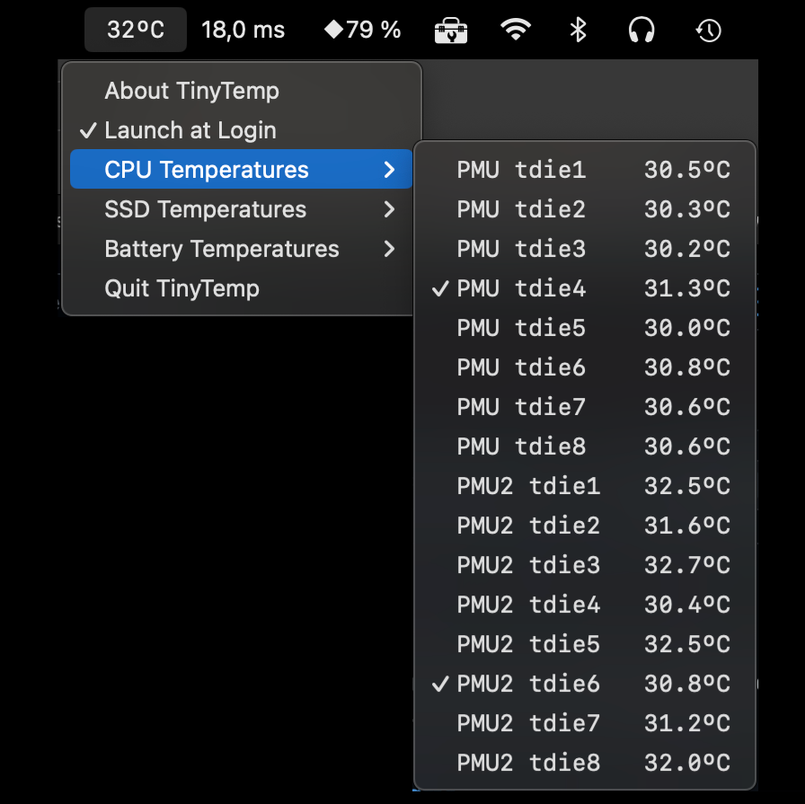

#  TinyTemp
A simple low-resource temperature monitoring app for the menu bar.

## Why another temperature monitor?
TinyTemp aims at using the lowest possible amount of resources. 
This goal is achieved by sticking to the bare minimum amount of data read from the system, 
as well as trying to be as efficient as possible in handling the data and presenting it to the user. 

Therefore, only the CPU temperature is displayed in the status item, with SSD and Battery temperatures added to the tooltip.
Temperatures are averaged over the selected sensors.

This results in a typical CPU load of less then 0.2%.

## Prerequisites
- macOS 13.0 or later
- Apple Silicon Mac 

## Installation
### Install binary
The release includes a binary that is notarised by Apple. It has to be placed in the `/Applications` folder.

### Install from source
Use Github's `Open in Xcode` feature to fetch one of the current branches, or download a `zip` file from one of the releases. 
There are no dependencies, therefore compilation should be straightforward. 
Be sure to sign the binaries correctly, 
either using your own team, or sign to run locally. 

## Command-line Interface
If the executable is called with the `-dump` option, it will dump the current temperature values to `stdout`. 
Any value after this option will be interpreted as a time interval in seconds to repeat the dump.

Example: `/Applications/TinyTemp.app/Contents/MacOS/TinyTemp -dump 1` will dump the current temperature values to `stdout` every second.
